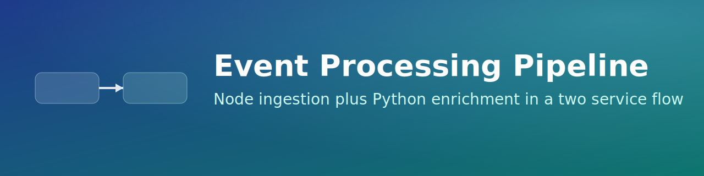

# Event Processing Pipeline

Two service demo pipeline where a Node.js API ingests events and forwards them to a Python service for enrichment.

## Architecture
1. Client sends event payload to `POST /api/events` on the Node service.
2. Node service forwards payload to Python `POST /enrich`.
3. Python service returns enriched metadata response.

## Tech Stack
- Node.js + Express
- Python + Flask
- Axios

## Run Locally
Terminal 1:
```bash
cd server
npm install
node index.js
```

Terminal 2:
```bash
cd python-api
python3 -m venv .venv
source .venv/bin/activate
pip install flask
python app.py
```

Send a test event:
```bash
curl -X POST http://127.0.0.1:3000/api/events \
  -H "Content-Type: application/json" \
  -d '{"event":"checkout","user_id":"123"}'
```
